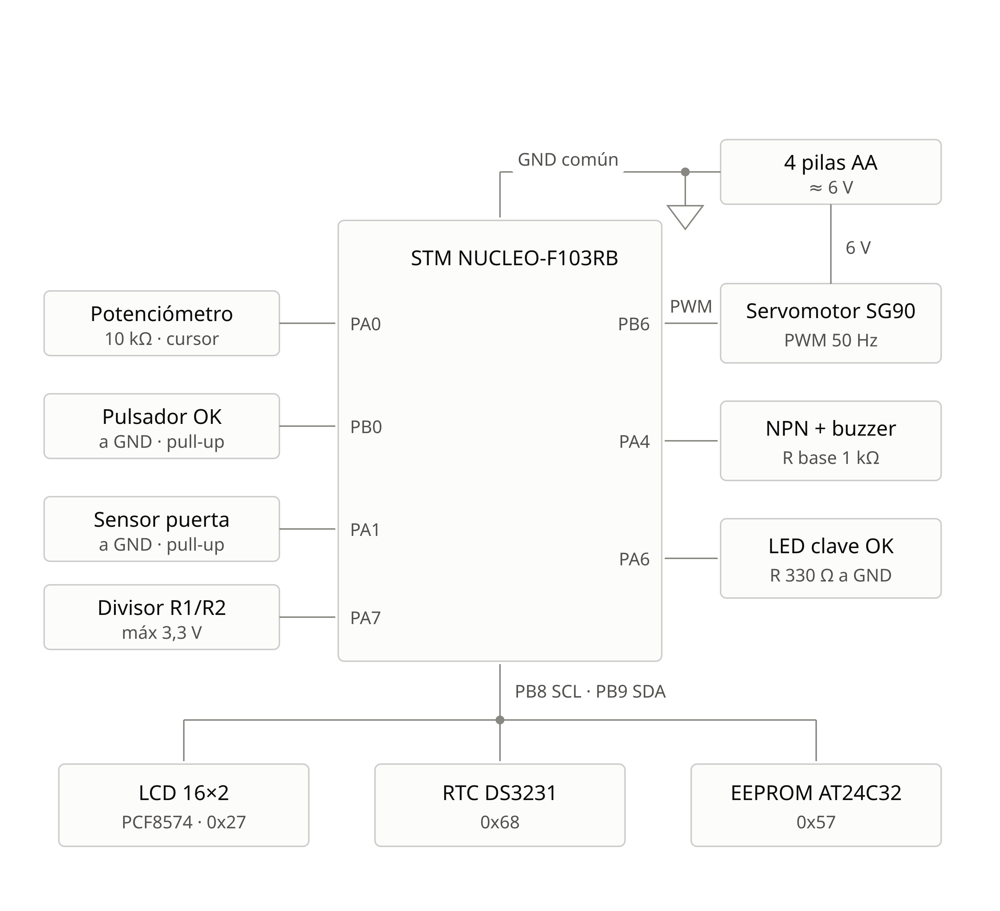
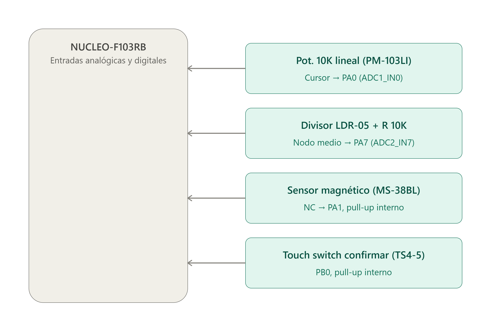
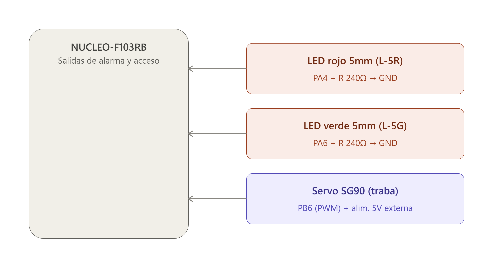
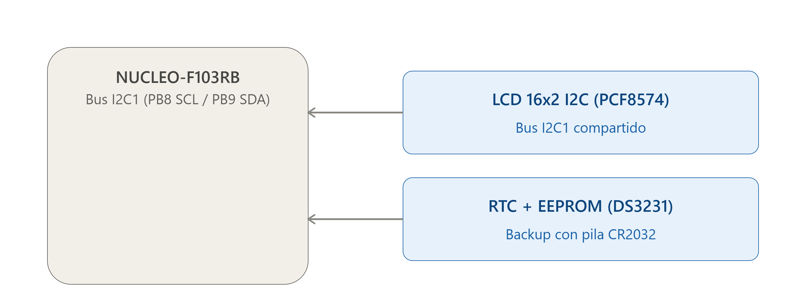

# Memoria: Cerradura Electrónica de Alta Seguridad

**Año-Cuatrimestre:** 2026-1erC
**Curso-Grupo:** 2-02

| **Apellido, Nombre** | **Padrón** |
| --------------------- | ---------- |
| Sanchez Q., Matias J. | 111060     |
| Laskowski, Marcos     | 104028     |
| Fanzi, Francisco      | 107510     |

---

## Índice
- [1. Pruebas de Integración (Video)](#1-pruebas-de-integración-video)
- [2. Hardware: Esquema y Cableado](#2-hardware-esquema-y-cableado)
- [3. Descripción del Comportamiento](#3-descripción-del-comportamiento)
- [4. Ensayos y Resultados](#4-ensayos-y-resultados)

---

## 1. Pruebas de Integración (Video)
En el siguiente video se presenta la demostración funcional del prototipo integrado. En el mismo se pueden observar los casos de uso principales: el ingreso de la clave mediante el dial analógico, el accionamiento del servomotor, y la respuesta del sistema ante la activación de las alarmas de seguridad (apertura de puerta y detección de luz).

- **Enlace al video:** [Pendiente para la defensa del 15/07]

**Aclaración sobre el video:** Este primer video de prueba lo grabamos en vertical por una cuestión de comodidad mientras trabajábamos. Para la entrega final, vamos a grabar el video en formato horizontal para que se pueda ver y evaluar mucho mejor.
## 2. Hardware: Esquema y Cableado
En la presente sección se documenta la implementación de hardware del sistema de control de acceso. A nivel teórico, se detallan los circuitos esquemáticos que vinculan el microcontrolador STM32-F103RB con los diferentes módulos. A nivel físico, se presentan fotografías del estado actual del montaje en las placas experimentales (el ensamble definitivo dentro del gabinete será documentado en la entrega final del proyecto).

**Esquemas Eléctricos:**
- **Esquema General:** 
- **Entradas analógicas y digitales** *(Potenciómetro, pulsadores, LDR y magnético)*: [
- **Salidas** *(Servomotor SG90 y alarmas)*: 
- **Bus I2C** *(Display LCD, RTC DS3231 y EEPROM AT24C32)*: 

**Vistas de Cableado:** - [Pendiente de inserción fotográfica del montaje actual para la entrega de hoy / defensa]

## 3. Descripción del Comportamiento
El sistema implementa un control de acceso centralizado en el microcontrolador STM32-F103RB. La interacción principal se realiza mediante un potenciómetro conectado al ADC1 (cuyo valor se mapea para seleccionar dígitos de 0 a 9), un pulsador de confirmación en el pin PB0, y el pulsador azul de administrador de la placa (B1), cuyo accionamiento permite ciclar entre los modos de operación. La salida visual hacia el usuario se despliega en un display LCD 16x2 gestionado mediante el bus I2C.

La lógica del firmware se organiza mediante una máquina de estados finitos que recorre cíclicamente tres modos principales:
* **Ingresar clave:** El usuario selecciona la secuencia de dígitos. Si la clave coincide con la almacenada, el sistema genera una señal PWM a 50Hz (mediante el timer TIM4) que posiciona el servomotor SG90 a 90 grados, liberando el cerrojo. Para garantizar el correcto funcionamiento, el servomotor se alimenta mediante una fuente externa de 5V. Esto se debe a que la placa por sí sola no lograba entregar la corriente necesaria, lo que provocaba que el motor no tuviera la fuerza para girar como corresponde.
* **Cambiar clave:** Permite capturar cuatro dígitos nuevos y escribirlos de forma persistente en la memoria EEPROM externa AT24C32 a través del bus I2C.
* **Menú:** Cuenta con un submenú que permite visualizar el tiempo de funcionamiento transcurrido desde que se colocó la pila en el módulo de la memoria EEPROM, y un registro histórico alojado en la EEPROM con los últimos 10 intentos de acceso, incluyendo la estampa de tiempo, la clave ingresada en ese instante y si el intento fue exitoso o fallido.

El sistema incorpora sensores para la protección del gabinete y una estricta gestión de energía:
* **Sensores de seguridad:** Un sensor magnético acoplado al pin PA1 monitorea el estado físico de la puerta. Si la puerta se abre sin que el sistema haya sido desarmado mediante una clave válida, o si la fotorresistencia (LDR) detecta un cambio brusco de luz en el interior (indicando una posible rotura de la caja), se activa inmediatamente la salida de alarma.
* **Modo Reposo:** Tras 15 segundos sin registrar actividad en los periféricos de entrada, el sistema apaga la retroiluminación del LCD para mitigar el consumo energético. El sistema despierta automáticamente al detectar una variación en la lectura del potenciómetro, garantizando que las rutinas de vigilancia de los sensores permanezcan siempre activas en segundo plano.

## 4. Ensayos y Resultados
A continuación, se presentan las métricas obtenidas tras la compilación y pruebas del prototipo. El análisis de memoria detalla la ocupación estática y dinámica del firmware en el microcontrolador, mientras que las mediciones restantes validan el comportamiento temporal y energético del sistema.

### 4.1 Análisis de Memoria (Console & Build Analyzer)
- **Secciones:** `text`: 23392 bytes, `data`: 96 bytes, `bss`: 2304 bytes.
- **Regiones:** 
  - **FLASH:** 17,92%
  - **RAM:** 11,72%

### 4.2 Medición de Tiempos (WCET) y Factor de Uso
*(Se empleó el registro DWT para medir los tiempos de ejecución de las tareas y calcular el Factor de Uso U de la CPU).*
- **Resultados de WCET:** 42955 µs (equivalente a 343646 ciclos de reloj).
- **Cálculo de U:** El factor de uso calculado es de 42,95%.

### 4.3 Medición y Análisis de Consumo Energético
*(Se documentaron las mediciones con amperímetro para los pines de alimentación, contrastando el consumo del sistema en funcionamiento normal frente al modo de bajo consumo).*
- **Resultados Consumo 3.3V / 5V:** 
  - **Ingresando clave (Operación normal):** 7,6 mA.
  - **Clave correcta (Accionamiento de servomotor):** 12,4 mA.
  - **Modo Reposo (Sleep):** 7,6 mA.
